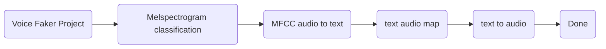

# Artificial Intelligence Course and Project

###### tags: `110上` `Artificial Intelligence` `LSTM` `Audio processing` `course` 

✏️This note record our project and course material of the NCTU course [Introduction to Artificial Intelligence](https://timetable.nycu.edu.tw/?r=main/crsoutline&Acy=110&Sem=1&CrsNo=1071&lang=zh-tw) in 2021 fall（110上學期）🏫 

## 🤖 About audio processing project

### Overview : The quick guide of the project

Copyright© of the project is belonged to our Project Member：[Chang,Yu-Jen](https://github.com/tstren1223)、[Chen,Chih-Cheng](https://github.com/joeChen1017)、[Chiang,Yung-chu](http://imyungchu.github.io). Note that no one shall download, reprint, reproduce, distribute, publicly broadcast, publish or distribute the research content of our project research in any form without written consent.

🏆 Award : Best voice application in the AI course. 

#### Motivation of the project

When it comes to voice faker, it downs on us that we often use the APP for instant speech recognition and text conversion in class or listening to speeches. We are interested in the recognition method of audio files such as human voice, so we would like to take the opportunity of the implementation of this topic to understand the logic more, and carry out some words. Simple identification model construction. This research will select a public speech data set—Common voice Dataset, and through the data preprocessing process, use the wavfile of Pytorch's  torchaudio package to visualize the frequency of the audio file into a picture, and then train it through a deep learning model , so that it can recognize some simple words, and improve the accuracy by adjusting the parameters.

#### Project proposal-Topic: Voice faker
- Goals:
We expected to input the sound from one person and output the sound from another person but with the same semantics.If everything is good, we can input a string and choose which tones we want to use and make AI to fake our voices.
:arrow_right: help the lazy guys and the speaking handicapped.
- Describes: 
This project is interesting because deepfake is popular, and we can combine them together. Then we can fake someone totally.(ideally)

- Topic related courses:
            1. Deep learning
            2. Convolutional neural network(CNN)
            3. Recurrent neural network(RNN)
            4. classification
            5. feature map
           
- Flow chart of our project

- Related prior work : 
>1. Using AI to fake sounds: [full paper link](https://reader.elsevier.com/reader/sd/pii/S0957417421008770?token=09BAA17D4759A830B56B39BFCF2766F14A88499D58F216277779BDB5D75C2D6F34BEAAB9C362D3B633D4C18BDA6224F2&originRegion=us-east-1&originCreation=20211112131342)
>◆ Deep4SNet is a text-independent classifier of original/fake speech recordings. 
>◆ It is based on a customized deep learning architecture.
>◆ Speech recordings are transformed into histograms to feed the model.
>◆ Experimental results are performed on Deep Voice and Imitation datasets.
>◆ The accuracy of the classifier is over 98%. 2. the article applied by Deep voice
>2. the article applied by Deep voice: [full paper link](https://arxiv.org/pdf/1802.06006.pdf)
>◆ Demonstrate and analyze the strength of speaker adaption approaches for voice cloning, based on fine-tuning a pre-trained multi-speaker model.
>◆ Propose a novel speaker encoding approach, which provides comparable naturalness and similarity in subjective evaluations while yielding significantly less cloning time and computational resource requirements.
>◆ Propose automated evaluation methods for voice cloning based on neural speaker classification and speaker verification. 
>◆ Demonstrate voice morphing for gender and accent transformation via embedding manipulations.

- Possible problems:
        1. How to process the tones from the same person.
        2. How to raise the precision.
- Plan:
11/22: Problem design (1/2) read and discuss four articles, learning the technique of deep voice. 
11/29: Problem design (2/2) read and discuss two papers, trying to come up with further insteresting problems base on these papers or use these papers as benchmarks.
12/6: Method and experiment design (1/3) sound recognition
12/13: Method and experiment design (2/3) sound classification. 12/20: Method and experiment design (3/3) sound fake.
12/27: End //review the whole work and composed a final project.

### Midterm progress updated: 

#### The things we've done before midterm of the course
Our theme is Voice faker, which can help people who are too lazy to speak or have difficulty in pronunciation to generate their own voices. In the last project proposal, we carried out according to the original plan. Before this week, we finished reading four deep voice technology teaching articles, two related research papers, and the first stage of experimental design for identifying sound. At present, colab has been used to do the second stage of experimental design classification, and the model has a 70% accuracy. Among them, sound recognition will use common voice dataset and CTC and Beam search algorithms to train Chinese and English, but it has not been trained yet. At present, the biggest problem we encounter is still studying how to use classification in actual files for feature block analysis. Our project proposal update is probably over here. 

#### Project Proposal Update -Topic: Voice faker

- Our procedure:
- [x] (1) What is sound and how it is digitized. What problems is audio deep learning solving in our daily live. What are Spectrograms and why they are all-important.
- [x] (2) Done Why Mel Spectrograms perform better and how to generate them.
:arrow_right: **The classification model we have built in Colab has about 70% accuracy rate.**
- [ ] (3) Enhance Spectrograms features for optimal performance by hyper-parameter tuning and data augmentation. Using MFCC (Mel Frequency Cepstral Coefficients) instead of Mel spectrogram.
- [ ] (4) Speech-to-Text algorithm and architecture, using CTC (Connectionist temporal classification) Loss and Decoding for aligning sequences.
- [ ] (5) Difficult Beam search Algorithm: commonly used by Speech-to-Text and NLP applications to enhance predictions

- We proceeded according to the original plan:
Note : Voice recognition will use common voice dataset and CTC and Beam search algorithms to train, but the training has not been completed yet.**★ The biggest problem we encounter now is that we are still studying how to us e classification in actual files for feature block analysis.**

### Final presentation: 

We finished the project as planned above, and was awarded with best voice application high honor from the professor. The whole file, including [LaTeX formal paper](https://github.com/imyungchu/Artificial-Intelligence-Course-and-Project/blob/main/Group_22_Final-report.pdf), [presentation PPT](https://github.com/imyungchu/Artificial-Intelligence-Course-and-Project/blob/main/Group-22_Final_prensentation_slide_Voice-faker.pdf), and the [code of our project](https://github.com/imyungchu/Artificial-Intelligence-Course-and-Project/blob/main/project.py) are all available in this repository. 

## :notebook_with_decorative_cover: The Homeworks and Materials of the course

Copyright© The homeworks and teaching materials is provided by the professor of the course, [Nick Wang](https://arg-nctu.github.io) , and the answers in some code blocks is added by me.

| Homework Description  |  link              | 
| ----------------- |:----------------------- |
| Lab1: Intro to AI - Python tutorial  | [:link:][1]  |
| Lab2: AI agent - nbgrader & search   | [:link:][2]  |
| Lab3: AI gym - taxi problem      | [:link:][3]    | 
| Lab4: Multilayer Perceptron (MLP)  learning       | [:link:][4]     |
| Lab5: Convolutional neural network & pytorch      | [:link:][5]     |
| Lab6: ros docker - msg & package & unittest| [:link:][6]|
| Lab7: Transfer learning       | [:link:][7]     |
| Lab8: Detection & segment - clutter maskrcnn     | [:link:][8]     |
| Lab9: Reinforcement learning - Deep Q learning       | [:link:][9]     |
| Lab10: Deterministic policy gradient - DDPG & RDPG  | [:link:][10]     |

[1]: https://github.com/imyungchu/Artificial-Intelligence-Course-and-Project/blob/main/0813317-江詠筑/20210913-intro-to-ai/ai_intro_01_01_Python_Tutorial.ipynb

[2]: https://github.com/imyungchu/Artificial-Intelligence-Course-and-Project/tree/main/0813317-江詠筑/20210927-ai-agent

[3]: https://github.com/imyungchu/Artificial-Intelligence-Course-and-Project/tree/main/0813317-江詠筑/20211004-ai-gym

[4]: https://github.com/imyungchu/Artificial-Intelligence-Course-and-Project/blob/main/0813317-江詠筑/20211018-mlp-learning/ai_intro_2021_04_01_mlp-learning.ipynb

[5]: https://github.com/imyungchu/Artificial-Intelligence-Course-and-Project/tree/main/0813317-江詠筑/20211025-pytorch-cnn

[6]:https://github.com/imyungchu/Artificial-Intelligence-Course-and-Project/tree/main/0813317-江詠筑/20211101-ros-docker

[7]:https://drive.google.com/drive/folders/1z-0KaqHr-aiGlPrRt0P_aIfhGqijA1lV?usp=sharing

[8]:https://drive.google.com/drive/folders/1A6v4D-nq_DG0MECsZs0lPfqnmV-REMrT?usp=sharing

[9]:https://github.com/imyungchu/Artificial-Intelligence-Course-and-Project/blob/main/0813317-江詠筑/20211213-dqn/ai_intro_2021_09_01_dqn.ipynb

[10]:https://github.com/imyungchu/Artificial-Intelligence-Course-and-Project/tree/main/0813317-江詠筑/20211220-ddpg-rdpg

> Bonus: Slide and notes of the class :100: 
> 1. Teacher's Slide and materials in [2020](https://drive.google.com/drive/folders/1-KJK5rbyZaV2eqlt2eKCM-AuIOE8S4ck?usp=sharing) / [2021](https://drive.google.com/drive/folders/1W7X5oN1T0vYpSutkmMSzbawQ_SSEyBrw?usp=sharing)
> 2. [My notes](https://drive.google.com/drive/folders/1qYbSd_0JyLRiNqtxnDmT-WHKdSJraAes?usp=sharing)

- Watch MORE of my projects ➜ [My GitHub repositories](https://github.com/imyungchu?tab=repositories)

